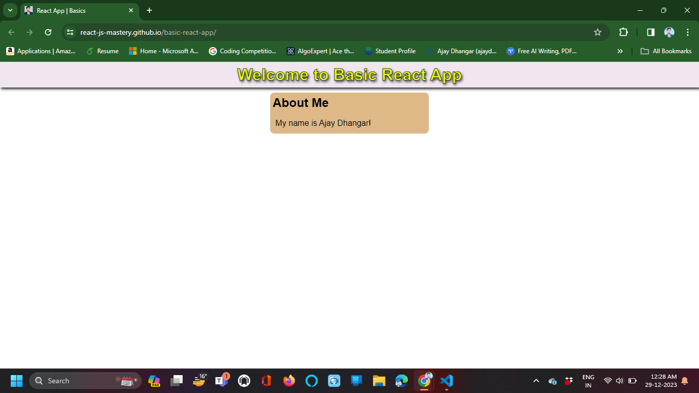

# Getting Started Basic React App

Let's start by writing pure React. No compile step. No JSX. No Babel. No Webpack or Parcel. Just some JavaScript on a page.

## Step 1: Create a new HTML file

Create a new file called `index.html` and paste the following code into it:

```html
<!DOCTYPE html>
<html lang="en">
<head>
    <meta charset="UTF-8">
    <title>React App | Basics</title>
    <meta name="viewport" content="width=device-width, initial-scale=1.0">
   
    <!-- React CDN is used to get the React Library from the Internet -->     
    <!-- React 18 Script for React Library -->
    <script src="https://unpkg.com/react@18.2.0/umd/react.development.js"></script> 

    <!-- React 18 Script for React DOM Library -->
    <script src="https://unpkg.com/react-dom@18.2.0/umd/react-dom.development.js"></script>

    <link rel="stylesheet" href="./style.css">
    
</head>
<body>
    
    <div id="root">Not Reandered!</div> 
    
    <!-- Used refrence of external Js file -->    
    <script type="module" src="./index.js"></script>  

    <!-- React 18 Script for Babel Library -->
    <script src="https://cdnjs.cloudflare.com/ajax/libs/babel-standalone/6.26.0/babel.min.js"></script>   
        
</body>
</html>
```

## Step 2: Create a new JS file

Create a new file called `index.js` and paste the following code into it:

```js
const App = () => {
    return React.createElement(
        "div",
        {
            "id": "main"
        },
        React.createElement(Header), 
        React.createElement(About)        
    )
  };
  

  const Header = () => {
    return React.createElement(
        "div",
        {
            "id": "header"
        },
        React.createElement("h1", {}, "Welcome to Basic React App")        
    )
  }

  const About = () => {
    return React.createElement (
        "div",
        {
            "id": "about"
        },
        React.createElement("h2", {}, "About Me"),
        React.createElement("div", {
            "id": "about-me"
        }, 

        React.createElement("p", {}, "My name is Ajay Dhangar!")
        
        )
    )
  }

const root = document.getElementById("root");
const content = ReactDOM.createRoot(root);
content.render(React.createElement(App))
```

## Step 3: Create a new CSS file

Create a new file called `style.css` and paste the following code into it:

```css
* {
    margin: 0;
    padding: 0;
}

body {
    font-family: sans-serif;
    line-height: 30px;
}

#header {
    background-color: rgb(240, 230, 239);
    padding: 10px 20px;
    box-shadow: 2px 3px 5px #262626;
    text-align: center;
    color: rgb(224, 255, 22);
    text-shadow: 2px 3px 5px #262626;
    -webkit-text-stroke: 1px #000;    
}

#about {
    margin-top: 10px;
    margin-left: auto;
    margin-right: auto;
    width: 300px;
    height: auto;
    background-color: burlywood;
    padding: 5px;
    border-radius: 8px;
}

#about-me {
    margin-left: 5px;
    margin-top: 10px;
}
```

## Step 4: Open the HTML file in a browser

Click on the `index.html` file and open it in a browser. You should see the following:

[](https://react-js-mastery.github.io/basic-react-app/)

That's it! You've just created your first React app. It's not much, but it's a start.

> The next step is to learn how to use JSX to make your code more readable.

**Thanks for reading!**

***If you liked this repo, please don't forget to star it. It's a great way of motivating me to write more content like this.***